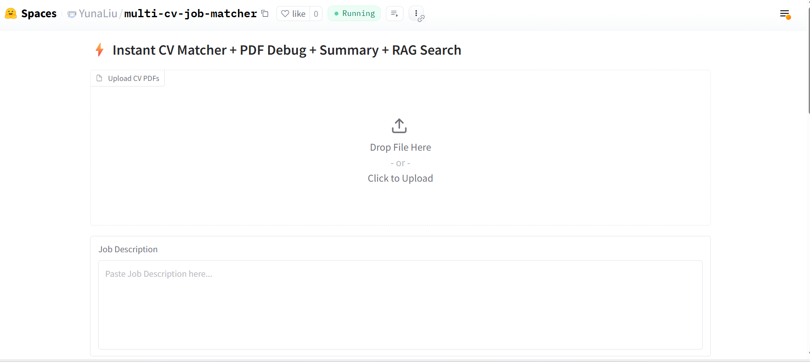
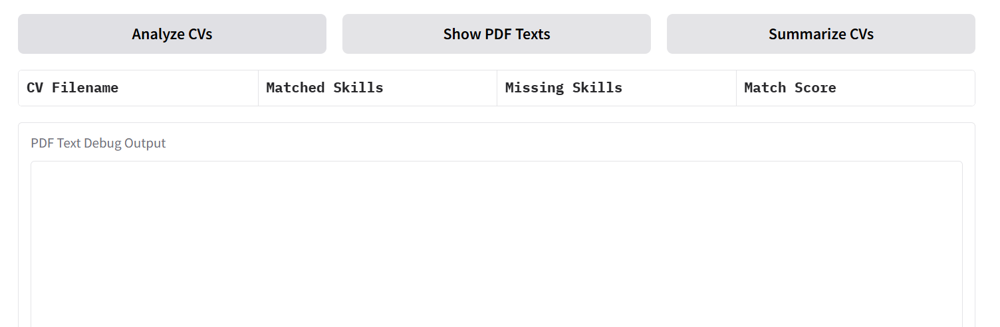

# Hugging Face RAG Multi-CV Job Matcher

🚀 **Live Demo (Hugging Face Space)**  
https://huggingface.co/spaces/YunaLiu/multi-cv-job-matcher

An end-to-end **CV analysis and job matching application** built with  
**Transformers + Sentence-Transformers + RAG (Retrieval-Augmented Generation)**.

Developed by Yuna Liu Data Engineer / AI Engineer

This project demonstrates how to:
- parse and debug CV PDFs,
- perform semantic skill matching,
- detect missing skills,
- and apply a lightweight RAG pipeline for job–CV alignment.

An example chatbot using [Gradio](https://gradio.app), [`huggingface_hub`](https://huggingface.co/docs/huggingface_hub/v0.22.2/en/index), and the [Hugging Face Inference API](https://huggingface.co/docs/api-inference/index).

---

## ✨ Key Features

- 📄 **Multi-CV PDF Upload**
- 🔍 **PDF Text Debug View** (raw extracted text inspection)
- 🧠 **Semantic Skill Matching (Transformer-based)**
- ❌ **Missing Skill Detection**
- 📊 **Match Score Calculation**
- 🔗 **RAG (Retrieval-Augmented Generation) Search**
- 🧱 **FAISS Vector Index (CPU)**
- 🖥️ **Interactive UI built with Gradio**

> ✅ This project **includes RAG**  
> ✅ This project **uses Transformer / Sentence-Transformer models**

---

## 🧠 Technical Highlights

- **Transformers**
  - Hugging Face `transformers`
  - `sentence-transformers` for embeddings
- **RAG Pipeline**
  - Text → Embeddings → FAISS → Semantic Retrieval → Matching
- **PDF Processing**
  - `pdfplumber` for robust PDF text extraction
- **NLP Utilities**
  - Tokenization & normalization via `nltk`
- **Vector Search**
  - `faiss-cpu`
- **UI**
  - `gradio`

---

## 🖼️ App Screenshots (Demo Preview)

> The following screenshots illustrate the full workflow of the application.

### 1️⃣ Upload CV PDFs and Job Description


### 2️⃣ PDF Text Debug View, Skill Matching & Missing Skills, and RAG-based Semantic Search



---

## 🔄 Application Workflow

1. Upload one or multiple CV PDFs  
2. Paste a Job Description  
3. Choose an action:
   - **Analyze CVs**
   - **Show PDF Texts (Debug)**
   - **Summarize CVs**
4. Review results:
   - Matched skills
   - Missing skills
   - Match score
   - Retrieved semantic context (RAG)

---

## 🧪 Tech Stack

```text
Python
Gradio
Transformers
Sentence-Transformers
FAISS (CPU)
Torch
PDFPlumber
NLTK
NumPy
🛠 Run Locally (Optional)
bash
Copy code
git clone https://github.com/yuna-liu/huggingface-rag-multi-cv-job-matcher.git
cd huggingface-rag-multi-cv-job-matcher
pip install -r requirements.txt
python app.py
Then open:

text
Copy code
http://localhost:7860
🌍 Deployment
Originally deployed on Hugging Face Spaces

Designed to be portable to:

Docker

Cloud VMs

Enterprise ML platforms (e.g. Databricks + MLflow)

🎯 Use Cases
CV screening & recruitment automation

Skill gap analysis

Resume-to-job semantic matching

RAG / LLM engineering portfolio demo

Document understanding workflows

📌 Notes
This repository focuses on engineering transparency and reproducibility.

The goal is to clearly demonstrate:

how RAG is implemented,

how Transformer-based embeddings are used,

and how CV–job matching works end-to-end.


